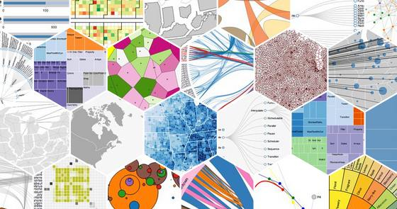

# Learning D3 :

I discovered that D3.js is very very complex & magnificent.
didn't expect that at all.
D3.js is cool... this what i got after only 3 hours worth of studing...

####-  [Demo Link](http://ahmed-badawy.com/tests/d3/d3%20v4/6-adding%20tooltip.html)

### Look Ma, no hands.. ok, update: here's some more demos:-
####- [Demo 1](http://ahmed-badawy.com/tests/d3/d3%20v4/6-adding%20tooltip.html)
####- [Demo 2](http://ahmed-badawy.com/tests/d3/d3%20v3/5-another%20forse%20layout/)
####- [Demo 3](http://ahmed-badawy.com/tests/d3/d3%20v3/4-d3%20forse%20layout/)

& here's a collective fully elaperated demo for most important features of d3:-
####- [Demo](http://ahmed-badawy.com/tests/d3/d3%20v3/1-index.html)

### The full [GitHub Repo](https://github.com/Ahmed-Badawy/D3-Learning)